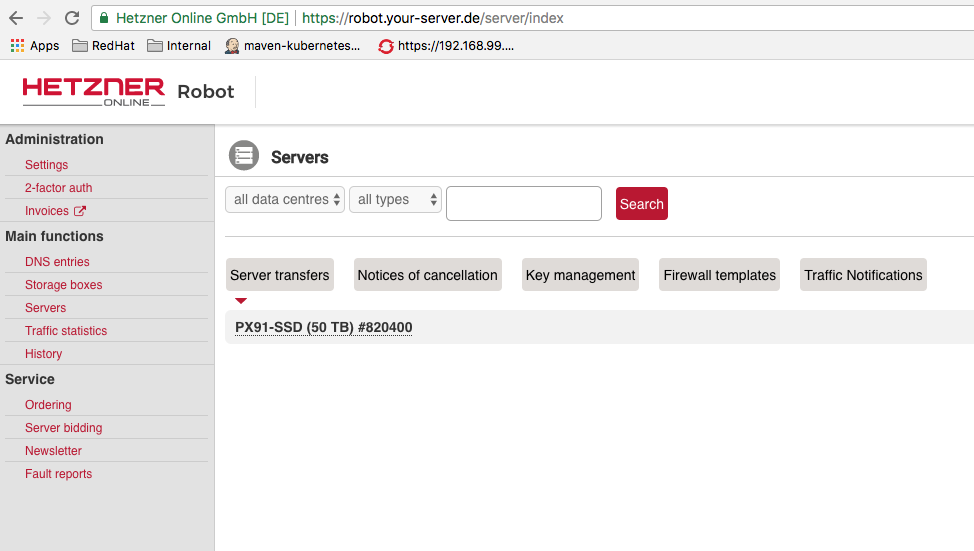
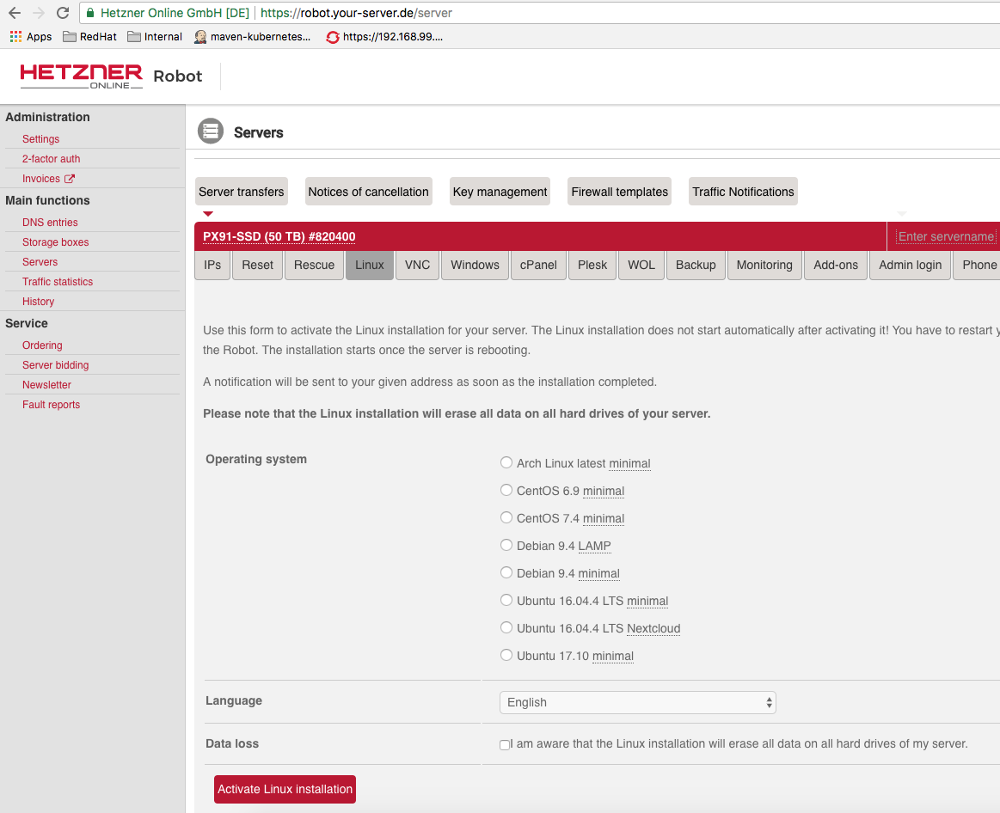

## OS Installation on Hetzner Cloud Machine

You first need to login to Hetzner robot
at https://robot.your-server.de/server and then select your machine by clicking on its the server link

E.g : `PX91-SSD (50 TB) #820400`

 

### Install CentOS 7.4 Minimal

Next, we will install the CentOS 7 OS which is proposed by Hetzner Cloud Platform.

* Select CentOS 7.4 in Linux tab and accept initiate installation. Take care to note the root password supplied.



* Initiate a reset from the Reset tab.


* Wait a few minutes for the installation to complete

### Copy your ssh public key to the machine

You need to perform a `ssh-copy-id root@ipaddress` in order to later perform password-less login
The root password is supplied via email when the Hetzner machine is initially created
Save it under the file `pwd.txt`

From a terminal, you can then execute the following command to add your public key within the list of the authorized keys of the cloud vm

E.g

```bash
sshpass -f pwd.txt ssh-copy-id -i ~/.ssh/id_rsa.pub root@ipaddress
```

### Prerequisites

In order to install OpenShift using the `openshift-ansible` playbook, it is mandatory to install first the NetworkManager Package 

```bash
yum install -y NetworkManager
systemctl enable NetworkManager
systemctl start NetworkManager
```

like also :
 
 - `Ansible` as `openshift_env` role uses the Ansible Python scripts
 - `python-rhsm-certificates` which is required to access the Red Hat Docker registry

```bash
yum install -y ansible python-rhsm-certificates
```

## Install OpenShift

Follow the instructions in `../ansible/README-cloud.md`
